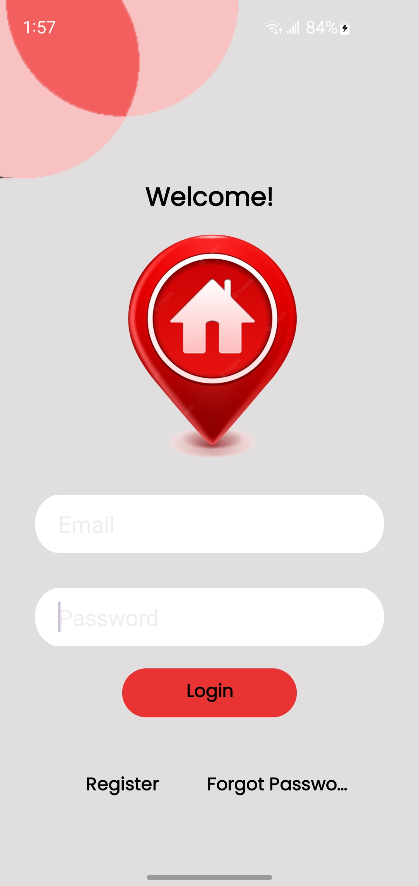
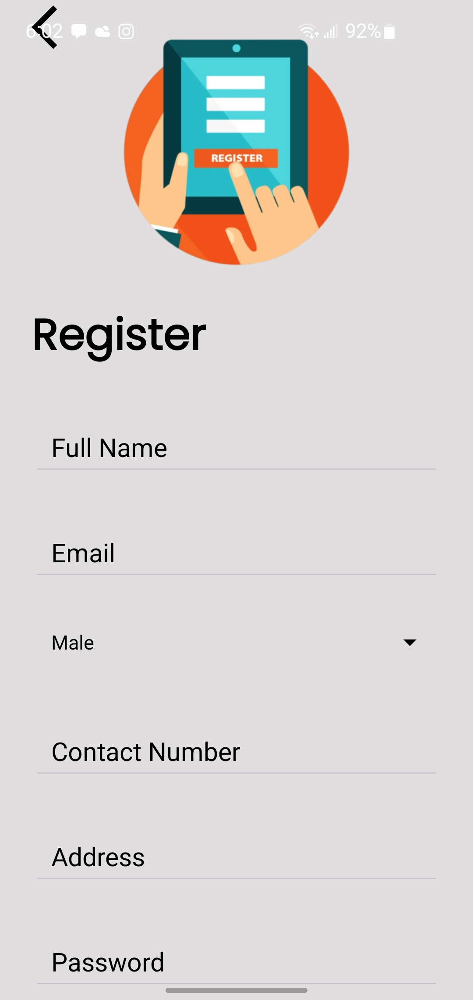

# 📱 LoginApplication – Android Login & Register System (Java + SQLite)

This is a complete Android application built with Java and SQLite, featuring user authentication functionality including Login, Registration, Forgot Password, and Reset Password. It uses modern UI design with XML layouts and a local SQLite database.

---

## ✨ Features
- 🔐 User Login & Registration  
- 🔄 Forgot Password with reset option  
- 💾 SQLite database integration  
- 🎨 Clean, modern UI with Material Design  
- 🚀 Lightweight and beginner-friendly

---

## 🛠 Tech Stack
- Java  
- Android SDK  
- XML  
- SQLite

---

## 📂 Structure
- `MainActivity.java` – Login Screen  
- `RegisterActivity.java` – Register Screen  
- `HomeActivity.java` – Post-login Welcome  
- `DBHelper.java` – SQLite database logic  
- `activity_main.xml` – Login layout  
- `activity_register.xml` – Registration layout  
- `activity_home.xml` – Home layout  

---

## 🧭 App Flow Screenshots

### 🔑 Login Screen

### 📝 Register Screen

### ❓ Forgot Password Screen

### 🔁 Reset Password Screen

---

## 📦 Usage
1. Clone the repository  
2. Open the project in **Android Studio**  
3. Run it on an emulator or real device (Android 8.0+)  

---

## 💡 Author
**TechHive HQ**  
[YouTube Channel](https://www.youtube.com/@TechhiveHQ)
